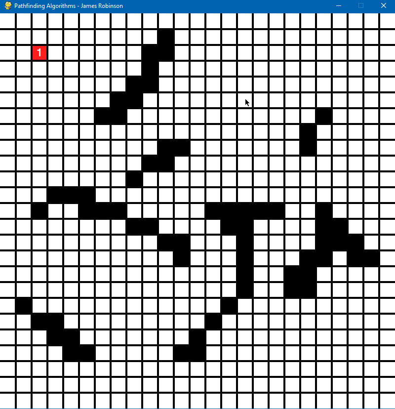
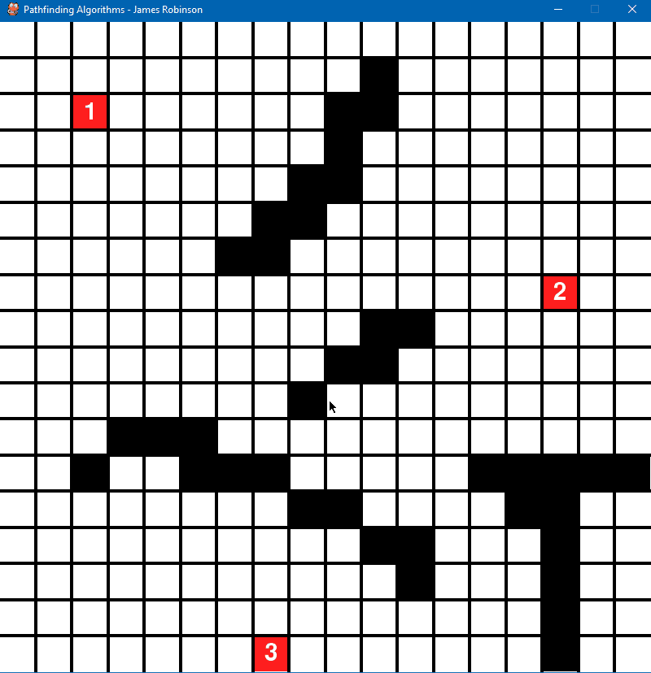
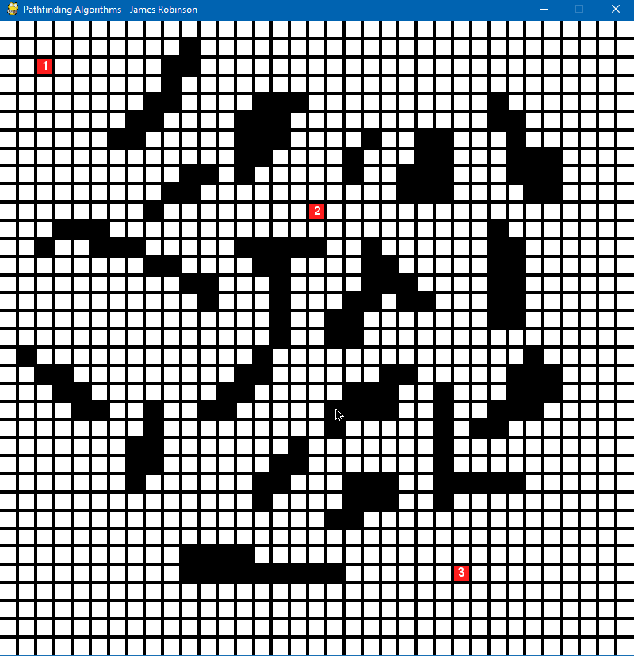

# Path-Finding-Visualisation-with-Pygame
A path-finding visualisation program using Pygame

Deminstration Video - https://www.youtube.com/watch?v=aW9kZcJx64o
# Features
1. Pygame GUI
2. Placeable walls/obsticles in the gui
3. Placeable checkpoints for the pathfinding algorithm to follow
4. 4 different pathfind algorithms; Depth-first search, Breadth-first search, dijkstra and A*
5. Hotkeys to remove cirtain details from the gui
6. Adjustable speed of visualisation
7. Adjustable size of the grid by scrolling

- Keybinds listed at the bottom of the readme

# Depth-first Search
- Rule of expansion - Expand most recently added node
- Order of expansion - Up, Right, Down, Left
- Doesn't give the shortest route most of the time
- Acts like humans in perfect mazes and sometimes can be way faster than other algorithms

        

- However even on the simplest mazes it can skip right past the end point

# Breadth-first search
- Rule of expansion - Expand least recently added node
- Acts like a wide net that covers every node that is closest in order
- Always finds optimal route, however can be quite slow in long range searches

        

# Dijkstra
- Rule of expansion - Expand node closest to starting node using g value
- Because in this visualisation it can only move in 4 directions BFS and Dijkstra are identical in result but Dijkstra uses more computational power

        

# A Star
- Rule of exspansion - Expand node with lowest f value, aka node that is close to the straightest diagonal path from the start node to end node put simply
- Hueristic used is Manhanntan Distance

        

# And some gifs showing off some of its features
- The abilty to add and remove checkpoints

- The abilty to scroll the gui before, during and after the animation

- The abilty to adjust the speed of the animation to make it slower or faster (or even instant)

# Keybinds
- 1-9: Place checkpoints for the pathfinding algorithm
- Left Mouse Click: Place walls
- Right Mouse CLick: Remove walls or checkpoints
- q: Run DFS algorithm
- w: Run BFS algorithm
- e: Run Dijkstra algorithm
- r: Run A Star algorithm
- z: Remove the last runs visualisation
- x: Completely clear the board
- Mouse Scroll: Zoom in and out
- Space: Generate random walls/maze
- +: Increase speed of animation
- -: Decrease speed of animation
